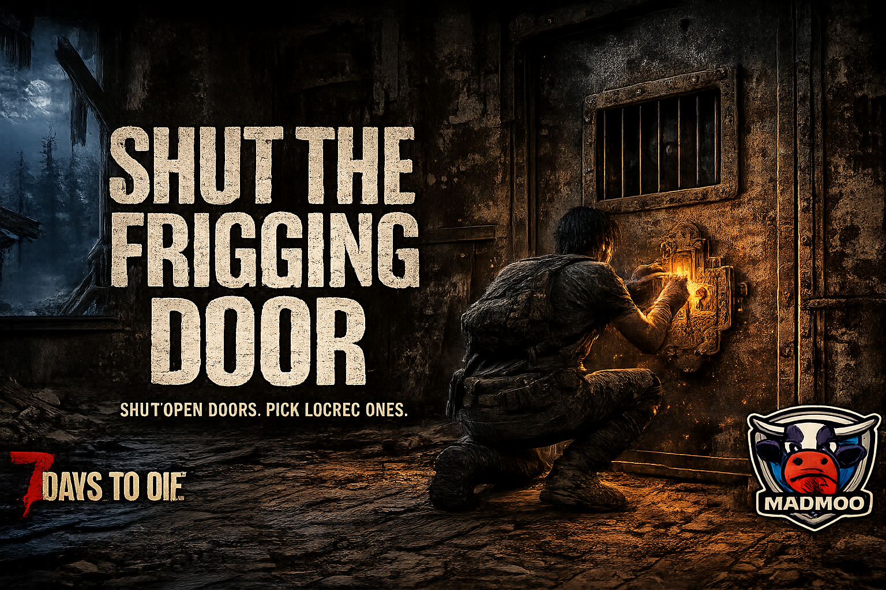

# Shut the Frigging Door (STFD)

[](https://github.com/Mad-M00/M00-STFD/actions/workflows/build.yml)
[](https://github.com/Mad-M00/M00-STFD/releases/latest)
[](https://github.com/Mad-M00/M00-STFD/commits/main)



**Were you raised in a barn?**

STFD is a 7 Days To Die mod that fixes doors. Doors that a switch or key
left *locked in the open position* become closable, and closed locked
doors can be lockpicked like a safe — with noise consequences.

## Features

- **Shut it** — doors opened by switches, keys and triggers are properly
  unlocked: walk through, close them, reopen them. Applies the moment a
  trigger fires, when a chunk loads, and on pressing E. Works on
  existing saves.
- **Pick it** — closed locked world doors run the vanilla hold-to-pick
  minigame. Difficulty scales by door type: wood 10s, iron 15s, steel
  20s, vault 30s (base times; the Lock Picking perk applies as it does
  to safes).
- **Fair picks** — progress survives a snapped pick, retries get safer
  as the lock nears open, and after 4 snaps on one door the next
  attempt is guaranteed.
- **Noise** — the unlock click can wake zombies behind the door (3m,
  50%); a snapping pick can pull the room (8m, 80%). Crouching muffles
  it; From The Shadows muffles it further.
- **Boundaries** — player-placed doors are never unlocked and never
  pickable; trader gates are untouched; closed doors only ever open
  through the pick minigame.
- **Configurable** — every number and both feature switches live in
  `STFDConfig.xml`, reloadable in-game with `stfd reload`.

## Installation

1. Copy the mod folder into `...\7 Days To Die\Mods\M00-STFD\`.
2. Start the game (EAC must allow mods; `SkipWithAntiCheat` is set).

Multiplayer: install on **both** server and clients. Server-only still
unlocks switch/key doors for every player; the client side adds the
press-E fix and the lockpick minigame. Pick noise is sent to the server,
so zombies genuinely wake for everyone.

## Documentation

### For players

| | |
|---|---|
| [Getting started](docs/user/getting-started.md) | What changes in your game, in two minutes |
| [Lockpicking](docs/user/lockpicking.md) | Difficulty, broken picks, perks, and the noise you make |
| [Configuration](docs/user/configuration.md) | Tuning STFDConfig.xml and reloading it live |
| [FAQ](docs/user/faq.md) | Multiplayer installs, trader gates, quest doors, sleeper wakes |

A compact version ships inside the mod folder as
[`ModAssets/README.txt`](ModAssets/README.txt).

### For mod authors

| | |
|---|---|
| [Design](docs/design.md) | The decompiled door internals and why these hooks |
| [Architecture](docs/architecture.md) | The three layers and the multiplayer model |
| [Testing](docs/testing.md) | Testing a game mod without the game |
| [Test POIs](docs/test-pois.md) | Prefab-data scan of every trigger-wired door in the game |

## Console commands (F1)

| Command | What it does |
|---|---|
| `stfd` | Shows the active settings: feature switches, tier table, noise numbers |
| `stfd reload` | Applies STFDConfig.xml edits without restarting |
| `stfd tier <blockName>` | Shows which difficulty tier a door resolves to |

## Building from source

Requires 7 Days To Die installed (edit `GameDir` in the csproj if yours
is not in the default Steam path).

```
dotnet build M00-STFD.csproj    # the game DLL
dotnet test                     # unit tests - no game needed
```

The mod compiles against the game's own Mono BCL (`NoStdLib` + the
game's `mscorlib.dll`) because the game's runtime includes
`Span`/`ReadOnlySpan`, which .NET Framework 4.8 reference assemblies do
not.

To deploy: copy the contents of `ModAssets\` plus
`bin\Debug\net48\M00STFD.dll` into the game's mod folder. The DLL can
only be swapped while the game is closed; config edits apply live via
`stfd reload`.
