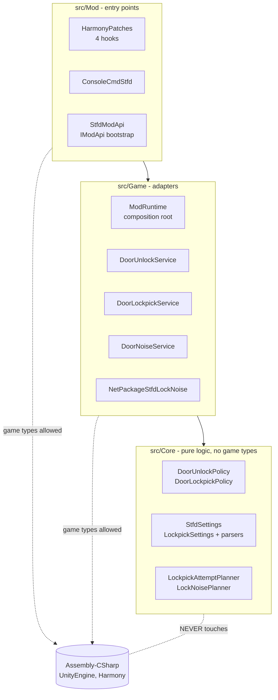

# Architecture

Three layers with a strict dependency rule: **code may only depend on
the layer below it, and only the lower layers may touch the game's
assemblies.**



## Core — the rules

- `DoorUnlockPolicy` — unlock iff the block is a door with a lock,
  standing open, flagged locked, and not player-placed.
- `DoorLockpickPolicy` — the complement: a *closed* locked world door
  may be lockpicked. A door matches exactly one of the two.
- `DoorObservation` — the game-free snapshot both policies decide on.
- `StfdSettings` / `LockpickSettings` + parsers — feature switches, the
  tier ladder, name/material rules, noise numbers. Resolution cascade:
  first matching door-name rule, then material rule, then default tier.
  A malformed config falls back to complete defaults.
- `LockpickAttemptPlanner` — attempt maths: resume time from earlier
  progress, snap chance scaled by remaining work, mercy cap, pre-rolled
  snap moment (the timer's `AlternateTime`). Random rolls are injected,
  so it is deterministic under test.
- `LockNoisePlanner` — noise scaling for sneak and the server-side
  clamp for network input.
- `WildcardPattern`, `NoiseProfile`, `IDoorLog`.

Core never sees a `TileEntityComposite`; that is what lets every rule
boundary be tested without a game install.

## Game — adapters

- `DoorObservations` — the one place a tile entity is read into a
  `DoorObservation`.
- `DoorUnlockService` — applies the unlock verdict. `SetLocked(false)`
  marks the tile entity modified, which also syncs it to clients.
- `DoorLockpickService` — drives the vanilla safe-cracking machinery:
  `XUiC_Timer` for the hold-to-pick UI, `EffectManager` for the Lock
  Picking perk (`LockPickTime`/`LockPickBreakChance`), lockpick
  consumption on snap, per-door progress and snap counts
  (session-scoped, like vanilla safes).
- `DoorNoiseService` — finds `EntityEnemy` in the sneak-scaled radius
  (`World.GetEntitiesInBounds`), rolls each against the alert chance,
  wakes the hits (`ConditionalTriggerSleeperWakeUp` +
  `SetInvestigatePosition`). Sneak quietness = config factor × the
  game's `NoiseMultiplier` passive, so From The Shadows applies
  unchanged.
- `NetPackageStfdLockNoise` — carries a pick noise from a client to a
  dedicated server. Lives in Game because the noise service sends it;
  `ProcessPackage` sanitises (`ValidEntityIdForSender`,
  `ClampIncoming`) and delegates back. The class name is the wire
  identity — renaming it after release breaks protocol between
  mismatched versions.
- `ConfigurationLoader`, `UnityDoorLog`, `ModRuntime` (composition
  root). Services read settings through accessor functions, so
  `ReloadConfiguration()` swaps one object and everything sees it.

## Mod — entry points only

Patch bodies are a try/catch around a one-line delegation. Logic inside
a patch belongs one layer down, where it can be named and tested.

| Hook | Kind | Covers |
|---|---|---|
| `TileEntityComposite.OnBlockTriggered` | postfix | A switch, key or quest event toggled the door. On the composite (not the feature) so it runs after all modules processed the trigger. |
| `TileEntity.OnReadComplete` | postfix | Doors that load from disk or network already open+locked. |
| `TEFeatureDoor.OnBlockActivated` | prefix | E-press: a locked-open door unlocks (same press closes it); a locked-closed world door starts the pick timer and skips the original method. |
| `GameManager.SaveAndCleanupWorld` | postfix | World exit — clears per-world pick progress. |

`ConsoleCmdStfd` (`stfd | stfd reload | stfd tier <blockName>`) exposes
the settings and the live reload.

## The one static

Harmony patches are static, so they reach the object graph through
`StfdMod.Runtime`, set once in `InitMod`. It is the only mutable static;
everything behind it is instance-based and constructor-injected.

## Multiplayer model

Door and lock state live in server-owned tile entities; `SetLocked` →
`SetModified` broadcasts changes.

- Trigger and read hooks fire on the **server** — a server-only install
  covers switch/key/load unlocking for every player.
- The activation hook and the pick minigame run on the interacting
  **client**.
- Zombie AI runs on the authority: the noise service alerts locally
  when this process is the server, otherwise ships the pre-scaled noise
  to the server via the net package.

## Files on disk

```
M00-STFD.csproj        SDK-style project; compiles src/** into one DLL
src/Core, src/Game, src/Mod
tests/M00-STFD.Tests   xUnit project (see testing.md)
refs/                  metadata-only game assemblies for CI builds
tools/                 dev-time scripts (prefab trigger scanner)
packaging/             INSTALL.txt bundled into release zips
ModAssets/             shipped in the mod folder:
  ModInfo.xml, README.txt, STFDConfig.xml
```

The mod ships as a single DLL — Core is compiled into it — so there is
nothing to go wrong with load order in the game's mod loader.
